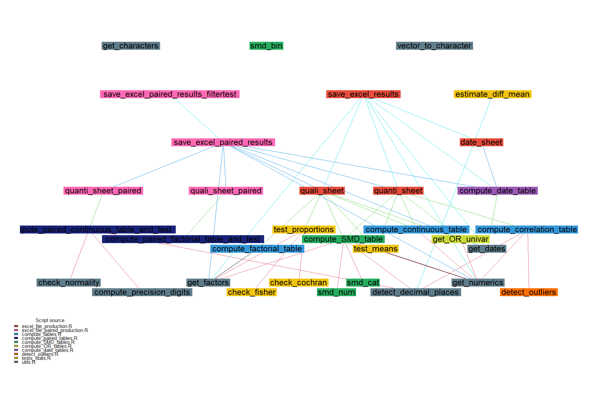

# R2Excel

<!-- badges: start -->
<!-- badges: end -->

The goal of *R2Excel* is to produce Statistical Tables in *R*, Save Into (*2*) *Excel* File. 

With this package, we don't propose any revolutionary statistical models or tests,
but we do recommend that you use this tool for the first stages of analysis in a clinical study.
Once you have your databases, you will naturally want to produce descriptive tables, 
and the first univariate or bivariate tests (if groups are present). 
We can help you to standardize these tables, while using the appropriate tests 
(implementation and verification of certain hypotheses, paired tests or captured messages). 
The main functions produce descriptive, homogeneous and harmonious statistical tables, 
as well as statistical tests.  

This package is used to generate statistical reports produced by the 
Methodology/Biostatistics Team of the GHICL DRCI (Lomme, France).

Feel free to participate to this project : It is designed to be open source under a 
[CECILL-2 Licence](https://cecill.info/licences/Licence_CeCILL_V2.1-en.txt) 
(French equivalent of the GPL license).
Any improvements or help with the documentation are welcome. 
Please create a branch to submit your merge request. 

French note : 

L'objectif de *R2Excel* est de produire des tableaux statistiques dans *R* et 
de (*2*) l'enregistrer dans un fichier *Excel*. 

Avec ce package, nous ne sommes pas en train de vous proposer des modèles ou 
tests statistiques révolutionnaires, mais nous vous recommandons d'utiliser cet 
outil pour les premières étapes de l'analyse d'une étude clinique. 
Lorsque vous disposez des bases de données, vous souhaitez naturellement produire 
des tables descriptives, ainsi que ls premiers tests univariés ou bivariés 
(si présence de groupes). Nous vous proposons de standardiser ces tables tout en 
utilisant les tests adéquats (implémentation et vérification de certaines hypothèses, 
tests appariés ou encore messages capturés). 

Les fonctions principales produisent des tableaux statistiques descriptifs, 
homogènes et harmonieux ainsi que des tests statistiques.  

Ce package est utilisé pour générer les rapports statistiques produits par la 
cellule Méthodologie/Biostatistique du GHICL DRCI (Lomme, France).

N'hésitez pas à participer à ce projet : il est conçu pour être open source sous une 
[Licence CECILL-2](https://cecill.info/licences/Licence_CeCILL_V2.1-fr.txt) 
(équivalent français de la licence GPL). 
Toute amélioration ou aide à la documentation est la bienvenue. 
Pour ce faire, nous vous prions de bien vouloir procéder à la création d'une branche 
pour nous soumettre votre requête ("merge request"). 


## Authors

in alphabetic order 

  Mathilde Boissel [aut, cre],  
  Cassandra Chaldaureille [aut, cre],  
  Armand Elegbe [ctb],  
  Sahara Graf [aut],  
  Klervi Le Gall [ctb],  
  Saïd Maallem [ctb],  
  Laurène Norberciak [aut, cre],  
  Cristian Preda [aut, cre],  
  Stephane Verdun [aut]  

## Installation

Directly from GitHub, 

```r
# install.packages("devtools")
devtools::install_github("GHICL-DRCI/R2Excel")
```

Or manually,  

From the online repository : `https://github.com/GHICL-DRCI/R2Excel/`,  
Download the zipped repo : `> code > Download Zip`,  
On your machine, on R, `setwd("where_your_zip_is/");`,  
`unzip("R2Excel-master.zip");`, `file.rename("R2Excel-master", " R2Excel");`,  
Build it `shell("R CMD build R2Excel ")` (will produce the [pkg].tar.gz),  
Then install it from your local build, 
`install.packages("R2Excel_[version].tar.gz", repos = NULL)`  

Check your current version with `packageVersion("R2Excel")`

Usefull command to know what's new : `utils::news(package = "R2Excel")`

## Starter Pack

See some examples in `inst/StarterPack.Rmd` (`inst/StarterPack.html`)

## Publication 

See poster in `inst/poster_epiclin_R2EXCEL.pptx` (`inst/P58_R2Excel_MBoissel.pdf`)

## Function dependency graph

The following graph shows the dependencies between functions in the package, 
colored by source script (i.e. the hierarchy of which functions call which other ones, 
done with {mvbutils}) :

<!--  -->

<p align="center">
  
  <br/>
  <em>Function dependencies — colored by source script</em>
</p>

Rerun the code if you want to update it : `R2Excel/inst/figures/generate_R2Excel_foodweb.R`. 


# Notes

_internal notes for contributors_

## Local Load/Installation

+ Just load scripts/functions to try and test pkg during dev : 

Load all scripts 

`devtools::load_all()`

or manually,

```
r_files <- list.files("R", pattern = "\\.R$", full.names = TRUE)
sapply(r_files, source, .GlobalEnv)
# load toy data
list.files("data", pattern = "\\.rda$", full.names = TRUE)
load(file = "data/modified_state.rda")
load(file = "data/modified_sleep.rda")
library(data.table)
library(testthat)
library(roxygen2)
```


+ Installation :

First Build it.

``` r
## First Build it, 
# devtools::build() # "Build" > "More" > "Build Source Package"
```

Then, Make sure you are not in the "R2Excel" project (now using renv)

You can install the development version of R2Excel like :  

``` r
## Then, close the project, and go to the archive place :
setwd("X:/DRCI Methodologie/BIOSTATISTIQUES/")
## Secondly, Install it: 
## install our dev package from a local build 
# install.packages("R2Excel_0.1.0.tar.gz", repos = NULL)
# [...]
# install.packages("R2Excel_0.1.16.tar.gz", repos = NULL)
# devtools::build(args = "--no-build-vignettes") # test with vignette fails...
# install.packages("R2Excel_0.1.17.tar.gz", repos = NULL)
# [...]
install.packages(
  "R2Excel_0.2.2.tar.gz", repos = NULL, 
  lib = "X:/DRCI Methodologie/BIOSTATISTIQUES/R/R-4.3.0/library"
)
```

When installing, if you see the message "Warning in install.packages :
 le package ‘R2Excel’ est en cours d'utilisation et ne sera pas installé"  
You should restrat your R session first, and also make sure nobody is currently 
 using `R2Excel` in an open R session,
otherwise warn people they need to "Session > Restrat R" so we are sure "R2Excel" 
 is not more loaded in any environment. 
Proceed now to `install.packages`. 

If error when installing, you may need to remove temporary files before : 
see folder `BIOSTATISTIQUES/R/R-4.3.0/library/00LOCK-R2Excel`.

After loading the pkg : `library("R2Excel")`

Check your current version : `packageVersion("R2Excel")`

Useful command to know what's new : `utils::news(package = "R2Excel")`

Get the list of function exported in the package : `ls("package:R2Excel")`


## Tips to dev and maintain the package


1) After each modifications, think to re-run unit tests 
(see {testthat}, in folder `tests/testthat`)

And checks...

``` r
setwd("X:/DRCI Methodologie/BIOSTATISTIQUES/R2Excel/")
testthat::test_check("R2Excel")
# or # devtools::test()

# Aller dans le répertoire parent de ton package
cd "X:/DRCI Methodologie/BIOSTATISTIQUES"
# Check sans PDF
R CMD check --no-manual R2Excel
```

2) After adding a new option, try to not modify the default behavior, 
except if it is on purpose. 
In any case, think to add a documentation (with {roxygen2} style), 
update the manuals (in folder `man/`, with `roxygenise` function) and 
add a new specific unit test (in folder `tests/testthat`).

``` r
## update documentation ...
#' @param xyz A number. Default 3. [...]
#' @param option1 A logical. Default FALSE. [...]

## update man/
library(roxygen2)
roxygen2::roxygenise(clean = TRUE)

## update tests...
testthat::expect_true(is.list(res))

```

3) Fill the NEWS file to follow changes.

4) It is a good practice to prefix the functions that come from other packages ({prefixer}). 
It will help to fill `@imports` in roxygen documentation field and in DESCRIPTION file. 

The use of data.table operators need a specific call of 
`r usethis::use_import_from(package = "data.table", fun = ":=")`

5) Using toydata (in unit tests or in examples), 
we can add them in the pkg and document how we built them.

(help from https://www.r-bloggers.com/2024/10/beyond-functions-how-to-enrich-an-r-package-with-data/)

6) Add a vignette (on going)

``` r 
usethis::use_vignette("StarterPack")
# fill vignettes/StarterPack.Rmd
# ajouter rmarkdown and kntr comme deps
devtools::build_vignettes()  # Pour créer les fichiers nécessaires dans le package
devtools::build()  # Reconstruisez le package avec les vignettes
# installer le package 
# puis
vignette(package = "R2Excel")  # Cela devrait afficher "StarterPack"
vignette("StarterPack", package = "R2Excel")  # Pour afficher directement la vignette
```

Think to knit the vignette if you update some examples

7) Style tips : see "Code smells" 

+ https://luzkan.github.io/smells/

+ https://www.youtube.com/watch?v=7oyiPBjLAWY 

+ https://bookdown.org/content/d1e53ac9-28ce-472f-bc2c-f499f18264a3/

``` r
## try ... 
styler:::style_active_file()
lintr:::addin_lint()
```

8) If new functions, update the dependency graph. 

To do so, re run the code in `R2Excel/inst/figures/generate_R2Excel_foodweb.R`

9) Other good practices ? 

+ Please be kind and leave some notes here to help future contributors.

